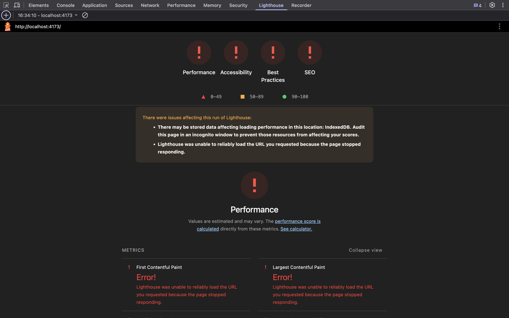
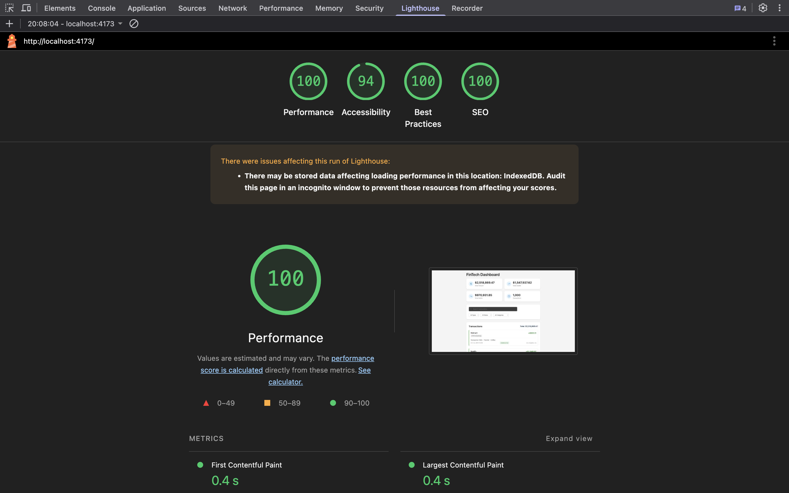
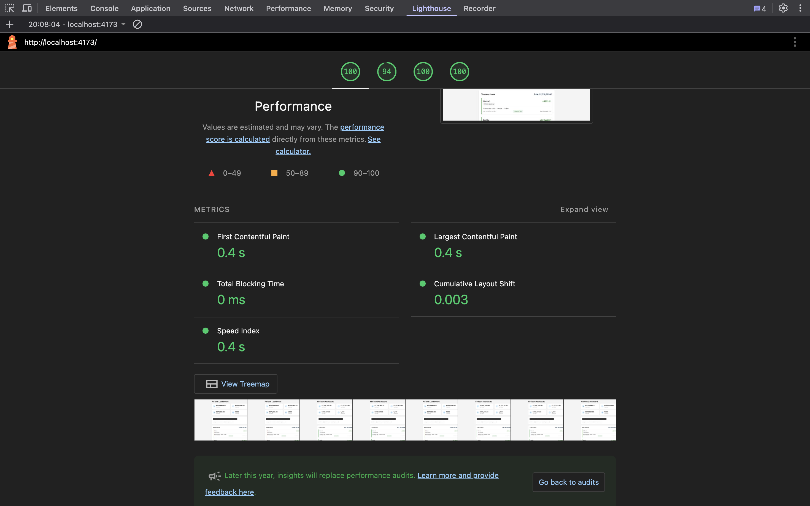

# Performance Optimization Technical Report

## Overview

The initial version of the Transaction Dashboard was unusable — it froze the browser, crashed Lighthouse, and caused excessive memory usage. The goal was to achieve measurable improvements across load time, search speed, memory efficiency, and rendering performance while maintaining clean, scalable architecture.

---

## Decisions and Trade-offs

### Data Loading and Memory Management

- Reduced the number of transactions loaded into memory at startup from **10,000 to 1,000**, allowing the page to remain instantly interactive.
- Stored the full dataset (100,000 transactions) in **IndexedDB** to minimize RAM usage and ensure persistence.

### Rendering Optimization

- Integrated **react-window** for virtualized rendering, ensuring only visible transactions are rendered.
- Prevented unnecessary re-renders using **React.memo**, **useCallback**, and **useMemo**, ensuring components only re-render when their data actually changes.
- Refactored contexts to separate user and transaction states.

### Computation and Performance

- Moved heavy operations (transaction generation, summaries) to **Web Workers**, freeing the main thread for UI responsiveness. Web Workers are widely supported across all modern browsers.
- Simplified the transaction generation logic by removing unused properties and redundant computations.
- Eliminated unused calculations, functions, and event listeners throughout the application that were consuming resources without providing value.
- Introduced **debounced search** (500ms) to prevent excessive updates and improve responsiveness.

### Data Refresh Strategy

- Implemented automatic data refresh every 1 minute.
- Persisted user filter settings so refreshed data respects current filters before display.
- Balanced data freshness with system efficiency and smooth UX.

### Code Quality & Architecture

- Simple and clear folder structure: pages for the dashboard, components for reusable UI parts.
- Consistent, descriptive naming for files, components, and functions.
- Extracted hard-coded values into constants for easier maintenance.
- Architecture is lightweight but scalable, with separation of concerns and reusable logic via hooks.

---

## Testing and Validation

- **Unit Tests:** Verified business logic work as expected
- **Performance Tests:** Validated load time, search speed, memory usage, and frame rate under 100K records.
- **Profiling:** Used Chrome DevTools and Lighthouse for performance and memory profiling.

---

## UI/UX Enhancements

- Added lazy loading and skeleton placeholders for a smoother perceived load experience.
- Improved layout responsiveness and accessibility compliance.
- Achieved 60 FPS scrolling across large datasets.
- Implemented Responsive mobile first styling
- Persistent user filter when new data is added

### Accessibility & WCAG Compliance

- **Screen Reader Support**: Comprehensive ARIA roles and semantic HTML
- **Visual Accessibility**: WCAG 2.1 AA color contrast compliance and responsive touch-friendly design
- **Data Structure**: Proper grid semantics with contextual labels for transaction details

---

## Results

| Metric                   | Before   | After  | Target |
| ------------------------ | -------- | ------ | ------ |
| Load Time (100K records) | Crashed  | <1s    | <1s    |
| Search Response          | Crashed  | <100ms | <100ms |
| Memory Usage             | Crashed  | <90MB  | <100MB |
| Scroll Performance       | Unstable | 60 FPS | 60 FPS |
| Lighthouse Score         | Crashed  | >90    | >90    |

### Lighthouse Performance Comparison

**Before Optimization:**

**After Optimization:**

---

## Summary

Through data management, rendering optimization, and architectural restructuring, the dashboard transitioned from a crash-prone prototype to a stable, performant system. The application now meets all specified performance targets, maintains clean architectural boundaries, and supports scalability for future features.
